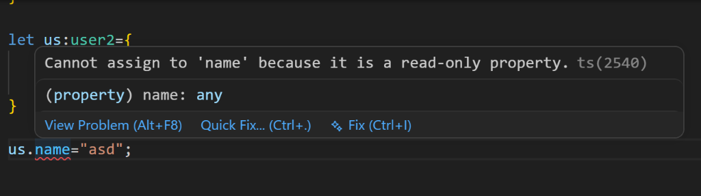
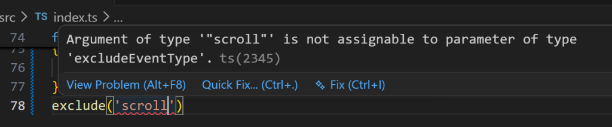

# TypeScript Learning: Part 3 🚀

Welcome to the third part of the TypeScript learning journey! In this section, we explore fundamental TypeScript concepts: **Interfaces**, **Utility Types (`Pick`, `Partial`, `Readonly`, `Record`, `Exclude`)**, and the differences between **`Record`** and **`Map`**.

All code demonstrations are implemented in [src/index.ts](file:///a:/web/week-14/typescript-learning-3/src/index.ts).

---

## Table of Contents
1. [Interfaces & Object Type Definitions](#1-interfaces--object-type-definitions)
2. [TypeScript Utility Types](#2-typescript-utility-types)
   - [`Pick<Type, Keys>`](#picktype-keys)
   - [`Partial<Type>`](#partialtype)
   - [`Readonly<Type>`](#readonlytype)
   - [`Record<Keys, Type>`](#recordkeys-type)
   - [`Exclude<UnionType, ExcludedMembers>`](#excludeuniontype-excludedmembers)
3. [Record vs. Map](#3-record-vs-map)
4. [Compiler Error Visualizations](#4-compiler-error-visualizations)

---

## 1. Interfaces & Object Type Definitions

Interfaces in TypeScript allow us to define the shape of an object. This ensures compile-time safety when passing objects to functions.

```typescript
interface user {
    name :string ,
    age:number
}

function sumOfAge(user1:user,user2:user):number {
    return user1.age+user2.age
}

let age=sumOfAge({name:"aditya",age:21},{name:"ayush", age:18})
console.log(age) // Output: 39
```

---

## 2. TypeScript Utility Types

TypeScript provides several built-in utility types to facilitate common type transformations.

### `Pick<Type, Keys>`
`Pick` allows you to create a new type by selecting a specific set of properties from an existing type or interface.

```typescript
interface person{
    name :string ,
    age:number ,
    addresh:string ,
    phone:number
}

// Select only 'name' and 'age' from 'person'
type updateprops=Pick<person,'name'|'age'>

function update(props:updateprops) {
    console.log(`name: ${props.name},age: ${props.age}`)
}

update({name:"aditya",age:21})
```

---

### `Partial<Type>`
`Partial` constructs a type with all properties of the input type set to optional. This is highly useful for patch updates or configuration objects.

```typescript
// Makes all properties in 'person' optional
type propsoptional=Partial<person>

function updateoptional(props:propsoptional) {
    console.log(`name: ${props.name},age: ${props.age}`+"  optional calling ")
}

updateoptional({name:"aditya"}) // Works without age, addresh, or phone!
```

---

### `Readonly<Type>`
The `Readonly` utility type constructs a type with all properties of the input type set to `readonly`. Once initialized, properties of the object cannot be reassigned.

```typescript
type user2={
     name:string ,
     age:number
}

let us:Readonly<user2>={
    name:"aditya",
    age:21
}

// ❌ Attempting to modify a readonly property will throw a compiler error
// us.name="asd";
```
*(See the compiler error screenshot below)*

---

### `Record<Keys, Type>`
`Record` is a TypeScript utility type for mapping keys to a specific type, creating structured dictionary/hash map representations.

```typescript
// Define a record where keys are strings and values are user objects
type userrecord = Record<string, {name:string, age:number}>

const recoredd:userrecord={
    "aditya":{name:"aditya",age:21},
    "kali":{name:"kishan",age:21}
}
```

---

### `Exclude<UnionType, ExcludedMembers>`
`Exclude` constructs a type by excluding from a union type all union members that are assignable to another specified union.

```typescript
type eventtype='mouse'|'scroll'|'click'

// Excludes 'scroll' event from eventtype union
type excludeEventType=Exclude<eventtype,'scroll'> // Result: 'mouse' | 'click'

function exclude(a:excludeEventType) {
    console.log(`event ${a}`)
}

// ❌ Attempting to pass 'scroll' will fail
// exclude('scroll')
```
*(See the compiler error screenshot below)*

---

## 3. Record vs. Map

While both `Record` and `Map` are used to store key-value pairs, they have different design patterns:

| Feature | `Record<K, V>` | `Map` |
| :--- | :--- | :--- |
| **Type** | TypeScript Compile-Time Utility Type | JavaScript Runtime Object |
| **Declaration** | Standard Object literal `{}` | `new Map()` |
| **Key Types** | Must be `string`, `number`, or `symbol` | Can be any type (including objects or functions) |
| **Methods** | Uses standard object accessors (`obj[key]`) | Uses `.set()`, `.get()`, `.has()`, `.delete()` |
| **Iteration** | `Object.keys()` or `for...in` | Built-in `.forEach()` and iterator support |

### Code Comparison:
```typescript
// Record Approach
const userRecord: Record<string, {name:string, age:number}> = {
    "aditya": {name:"aditya", age:21}
}

// Map Approach
const usermap=new Map()
usermap.set("aditya",{name:"aditya",age:21})
let userfrommap=usermap.get("aditya")
console.log(userfrommap?.name)
```

---

## 4. Compiler Error Visualizations

TypeScript's compiler actively prevents runtime issues by raising error squiggles when types are violated.

### Error 1: Modifying Read-only Properties
When attempting to modify a `Readonly<user2>` property (e.g. `us.name = "asd"`):



---

### Error 2: Passing an Excluded Type
When attempting to pass `'scroll'` to a function expecting type `Exclude<eventtype, 'scroll'>`:


